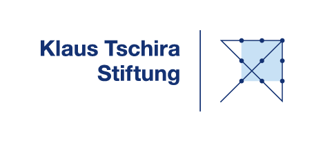

# Welcome to the Bio-Structure Hub

The Bio-Structure Hub is subunit of the [Scientific Software Center](https://www.ssc.uni-heidelberg.de) at the University of Heidelberg and provides a variety of services and resources for researchers in the field of computational structural biology. 

With the availability of general structure prediction methods like AlphaFold or Boltz, researchers have powerful tools to excel their research.
The Bio-Structure hub aims to aid researchers in the use of structure prediction models. 

We focus on sustainable software and reproducible science. We aim to bridge the gap between wet lab research and *in silico* predictions. 

The Bio-Structure Hub is enabled by the [Klaus-Tschira Stiftung](https://klaus-tschira-stiftung.de/) through project number 00.026.2024, Scientific Software funding line.

{ align=right : style="transform: scale(0.75);"}

