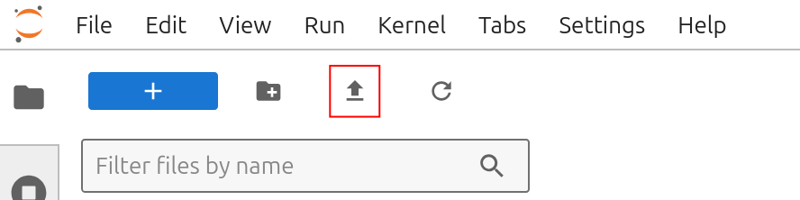
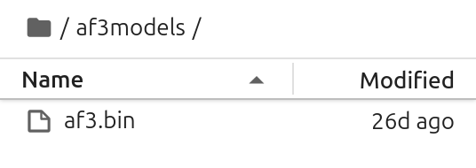
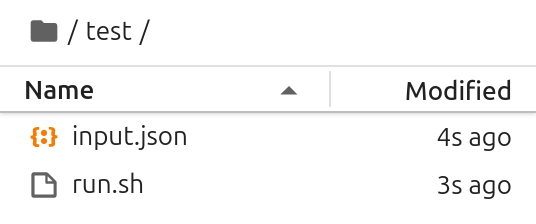
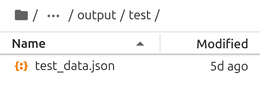
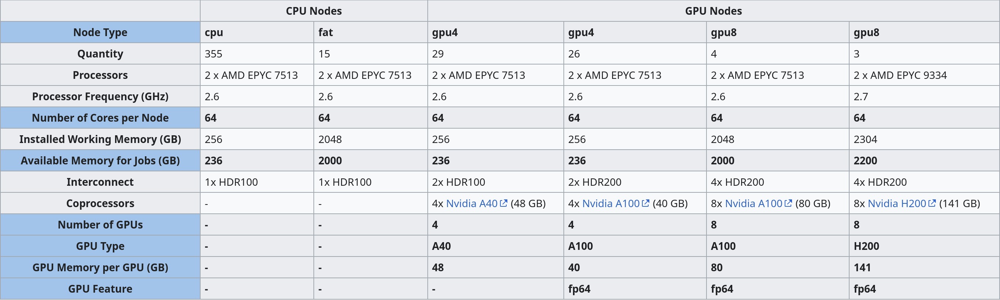
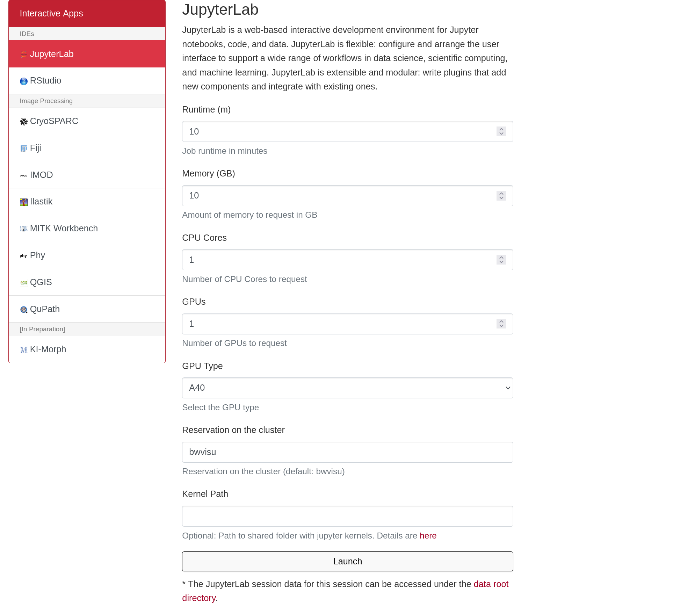
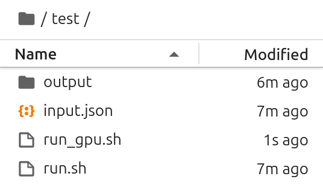
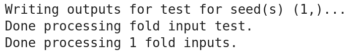
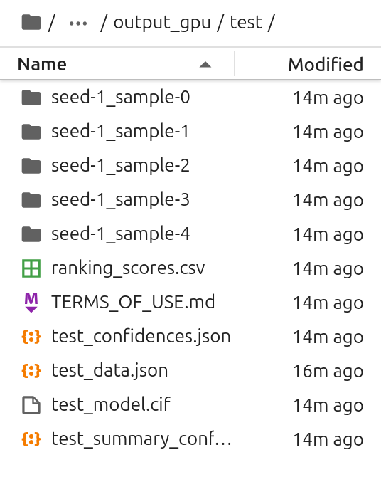
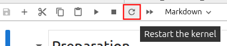

# AlphaFold3 on bwVisu

Welcome to the AlphaFold Tutorial for bwVisu! 

This tutorial will guide you through running AlphaFold on bwVisu. Please follow these steps carefully. Any feedback on the tutorial is welcome! Feel free to contact us!

### Step 1: Get access to bwVisu 

To start, get access to bwVisu via bwForCluster Helix or SDS. For more information, visit 

[https://www.urz.uni-heidelberg.de/en/service-catalogue/software-and-applications/bwvisu](https://www.urz.uni-heidelberg.de/en/service-catalogue/software-and-applications/bwvisu) 

For technical questions regarding the high performance cluster, see [https://bw-support.scc.kit.edu](https://bw-support.scc.kit.edu). Feel free to [contact us](/contact) for support.

### Step 2: Obtain Model Weights from AlphaFold 

Each user needs to individually obtain the model weights for AlphaFold3. Download the model weights from AlphaFold using this form:  

[https://forms.gle/svvpY4u2jsHEwWYS6](https://forms.gle/svvpY4u2jsHEwWYS6 ) 

**Please note that your use of AlphaFold is subject to the terms and conditions outlined in the [AlphaFold Terms of Use](https://github.com/google-deepmind/alphafold3/blob/main/WEIGHTS_TERMS_OF_USE.md). You are responsible for ensuring you comply with these terms.**

### Step 3: Connect to bwVisu and Start Jupyter 

Go to [https://bwvisu.bwservices.uni-heidelberg.de/](https://bwvisu.bwservices.uni-heidelberg.de/ ) and log in with your credentials and one-time password. Please note that you need to be connected to Heidelberg University's VPN if you are connecting from outside the campus.

Choose Jupyter and start a new session. 

### Step 4: Prepare for AlphaFold Prediction 

The first step of the AlphaFold prediction is a multi-sequence alignment (MSA). 

For the MSA step, select 8 CPU cores with 10 GB of memory. The GPU necessary for the second step will be requested later. 

<!--{: style="height:500px;width:750px"}-->

Click on "Launch". This will bring you to a new screen showing your interactive sessions. Wait for your session to be ready, then click on "Connect to Jupyter". This brings you into a JupyterLab environment.

Upload the notebooks in (link) by clicking on the upload button:

{: style="height:111px;width:444px"}

After the upload, you can see the notebooks in the file browser on the left.

The alphafold parameters need to be uploaded as well. After registration as shown above, you will receive a download link (takes about three days). The parameter file is zipped as `af3.bin.zst`. Unpack the file to obtain `af3.bin`. This file then needs to be uploaded to a directory in your home, such as `/af3models`. 

{: style="height:95px;width:268px"}

### Step 5: Set Up Your MSA Within the Notebook 

Open `Afold_Alignment_CPU.ipynb`.

#### Set Environment Variables 

Add the directory with the alphafold parameters to `ALPHAFOLD_MODEL_DIR`: 

    ALPHAFOLD_MODEL_DIR = Path.home() / "af3models"
		  

Decide where you want your working directory and output files to be: 

    ALPHAFOLD_WORKING_DIR = Path.home() / "afold_test"
    ALPHAFOLD_RESULTS_DIR_PART1 = ALPHAFOLD_WORKING_DIR / "output"

These directories can be created by clicking on the folder icon on the top left:

{: style="height:111px;width:444px"}
		  

#### Prepare Input File 

First we prepare the `.json` input file that will tell AlphaFold what to predict. An introduction to the json file format can be found [here](https://stackoverflow.blog/2022/06/02/a-beginners-guide-to-json-the-data-format-for-the-internet/#h2-81f8002b67730).

More information and examples on how these files are structured can be found in the [AlphaFold3 github](https://github.com/google-deepmind/alphafold3/blob/main/docs/input.md#top-level-structure), with example input files [here](https://github.com/google-deepmind/alphafold3/blob/main/docs/input.md#full-example). 

Important parameters in the input file are the `name`, `sequence` and `id`, which labels the chain ID. Upon executing this cell, the input file will be written to your working directory. Remember the `name` as it is needed later for the [diffusion run](#step-7-set-up-your-diffusion-run-within-the-notebook). 

#### Write Run File 

Next, we need to tell the AlphaFold3 program what to do with the input file, where to find the model weight parameters and where to write the output. Execute the next cell to write the run file that controls the execution. You don't need to worry about the parameters too much. They are prepared for you. Only change them if you know what you're doing. 

{: style="height:112px;width:268px"}

#### Run MSA Prediction 

Run the MSA prediction by executing the next cell: 

    os.system(f'bash {ALPHAFOLD_RUN_PATH}')
		  

This will take about 5-10 minutes, but eventually, you should see... 

{: style="height:53px;width:379px"}

#### Verify Output 

In the output directory, there should be a second `.json` file in the `output/test` directory. This includes all the information from the input file and the results of the MSA. 

{: style="height:89px;width:268px"}

You can now close this interactive session session on bwVisu, as the CPU is no longer needed, and move to the second step.

 

### Step 6: Prepare the Inference

The second step of the AlphaFold prediction is the inference of the structure by the model.

For the inference step we need a GPU, so we need to request a GPU node on bwVisu. A list of available GPUs and their specifications is available at [https://wiki.bwhpc.de/e/Helix/Hardware#Compute_Nodes](https://wiki.bwhpc.de/e/Helix/Hardware#Compute_Nodes), or in the table below.

<!--Cant I link this directly?-->

The GPU is selected by "GPU Type". The memory of each GPU Type is specified in GPU Memory per GPU (GB). For this example we select one of the A40 GPUs.

<!--{: style="height:500px;width:750px"}-->

Larger jobs (= longer sequences, more chains) require more memory. To access these, it is suggested to run the job directly on the Helix cluster. We will prepare a tutorial for this shortly - feel free to contact us!

### Step 7: Set Up Your Diffusion Run Within the Notebook
- dependencies are missing
 Open `AFold_Diffusion_GPU.ipynb`.

#### Set Environment Variables 

Add the directory with the alphafold parameters to ALPHAFOLD_MODEL_DIR: 

    ALPHAFOLD_MODEL_DIR = Path.home() / "af3models"
		  

Link the output of the MSA prediction, and the project name given in the MSA input file 

    ALPHAFOLD_WORKING_DIR = Path.home() / "afold_test"
    ALPHAFOLD_RESULTS_DIR_PART1 = ALPHAFOLD_WORKING_DIR / "output"

Decide where you want your output files to be: 

    ALPHAFOLD_RESULTS_DIR_PART2 = ALPHAFOLD_WORKING_DIR / "output_gpu"

#### Write Run File 

Next, we need to tell the AlphaFold3 program what to do in the second part. Execute the next cell to write the run file that controls the execution. You don't need to worry about the parameters too much. They are prepared for you. Only change them if you know what you're doing. 

{: style="height:159px;width:268px"}

#### Run the structure prediction 

Execute the next cells to run the alignment job. Good luck!	 

    os.system(f'bash {ALPHAFOLD_RUN_PATH}')

This may take a few minutes, but eventually, you should see... 

{: style="height:55px;width:357px"}

#### Verify Output

You should see the AlphaFold output files:

{: style="height:335px;width:268px"}

By default AlphaFold creates 5 samples from one seed, and sorts them in individual directories. Their ranking scores are reported in a csv table.
The best model is presented in the output directory as well, with its structure file and confidence descriptions. The latter are needed to judge the quality of the prediction.

**Please note that you must ensure your use and distribution of the AlphaFold outputs comply with the [Output Terms of Use](https://github.com/google-deepmind/alphafold3/blob/main/OUTPUT_TERMS_OF_USE.md).**

### Step 8: Analyze your results

Open the last notebook `Afold_Confidence_Levels.ipynb` to get a summary of the models confidence levels. This notebook reads the confidence descriptions and renders its central information.

For this last notebook, you need to install a few dependencies into your environment. These dependencies are libraries that are used to analyze and visualize the output. The dependencies are installed in the Jupyter notebook in the first code cell:

    %pip install biopython seaborn

After installing the dependencies, you need to restart the Jupyter kernel so that Jupyter finds the newly installed packages. Click on the circular arrow in the top left of the Jupyter notebook toolbar.

{: style="width:268px"}

After this, the analysis should run without any errors. Explanations of the output are provided in the notebook.

To visualize your predicted structures, download them to your computer and open the files with programs such as [Pymol](https://pymol.org/) or [ChimeraX](https://www.cgl.ucsf.edu/chimerax/). To visualize the pIDDT in "classic" AlphaFold colors, use [this](https://kpwulab.com/2023/03/09/color-alphafold2s-plddt/) quick tutorial. This allows to visualize more and less confident areas of the predicted structure.

