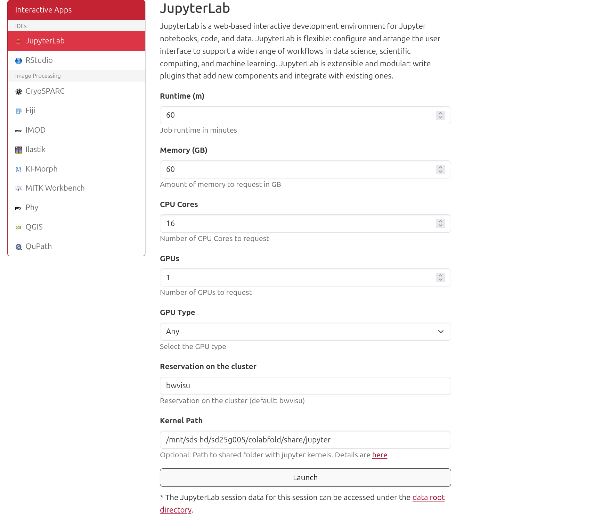
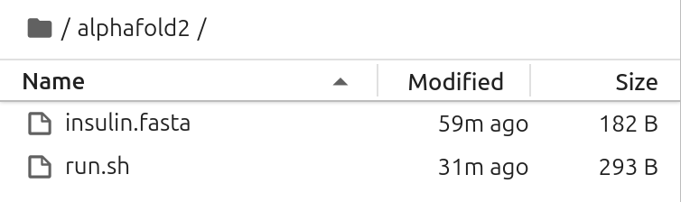

# AlphaFold 2 on bwVisu

Welcome to the AlphaFold 2 Tutorial for bwVisu! 

This tutorial will guide you through running <a href="https://github.com/google-deepmind/alphafold" target="_blank" rel="noopener">AlphaFold 2</a> on bwVisu. Please follow these steps carefully. Any feedback on the tutorial is welcome! Feel free to [contact us](../contact.md)!

## Preparation

### Step 1: Get access to bwVisu 

To start, get access to bwVisu via bwForCluster Helix or SDS. For more information, visit 

<a href="https://www.urz.uni-heidelberg.de/en/service-catalogue/software-and-applications/bwvisu" target="_blank" rel="noopener">https://www.urz.uni-heidelberg.de/en/service-catalogue/software-and-applications/bwvisu</a>

For technical questions regarding the high performance cluster, see <a href="https://bw-support.scc.kit.edu" target="_blank" rel="noopener">https://bw-support.scc.kit.edu</a>. Feel free to [contact us](../contact.md) for support.

## Part 1: Structure Prediction

### Step 2: Connect to bwVisu and Start Jupyter 

Go to <a href="https://bwvisu.bwservices.uni-heidelberg.de/" target="_blank" rel="noopener">https://bwvisu.bwservices.uni-heidelberg.de/</a> and log in with your credentials and one-time password. 

Choose Jupyter and start a new session. Now you can select the resources you need.

In contrast to Alphafold 3, Alphafold 2 can run in one bwVisu job that needs both CPU and GPU resources allocated. We choos one GPU, and 16 CPU cores. We also need to account for a longer runtime, so we choose 60 minutes. If you want to execute the analysis right after the prediction, you can load the neccessary python libraries by adding `/mnt/sds-hd/sd25g005/colabfold/share/jupyter` to the kernel path.

{:.invertable}
<!--{: style="height:500px;width:750px"}-->

Click on "Launch". This will bring you to a new screen showing your interactive sessions. Wait for your session to be ready, then click on "Connect to Jupyter". This brings you into a JupyterLab environment.

### Step 3: Set a Working Directory and Upload Files

First we need to define a working directory. That can be your `home` or any directory you create. These will contain all files necessary for the tutorial. A new directory can be created using folder icon on the top left of the file browser:

{: .invertable style="height:111px;width:444px"}

Next all required files need to be uploaded. This includes the notebooks from our <a href="https://github.com/ssciwr/BioStructureHub/tree/main/notebooks" target="_blank" rel="noopener">github</a> and the input sequence in `.fasta` format. You can upload these files by clicking on the upload button:

{: .invertable style="height:111px;width:444px"}

After the upload, you can see your files in the file browser on the left.

### Step 4: Start the Alinment 

Open `Afold2.ipynb` and execute the cells in the notebook to start your AlphaFold run!

#### Verify Input

Before starting your AlphaFold 2 alignment you should see the following files in your working directory:

{: .invertable style="height:112px"}

#### Verify Output 

In the output directory, there should be a second directory with the same name as your `.fasta` file, in which you find the multi-sequence alignment (MSA), the predicted structure in `.pdb` file format and other information in `.json` format.

## Part 2: Analysis

### Step 5: Analyze your results

Open `Afold2_Analysis.ipynb` and select the `colabfold` kernel. You can verify the kernel in the top right corner of your JupyterLab instance.
After this, the analysis should run without any errors. Explanations of the output are provided in the notebook.

To visualize your predicted structures, download them to your computer and open the files with programs such as <a href="https://pymol.org/" target="_blank" rel="noopener">Pymol</a> or <a href="https://www.cgl.ucsf.edu/chimerax/" target="_blank" rel="noopener">ChimeraX</a>. To visualize the pLDDT in "classic" AlphaFold colors, use <a href="https://kpwulab.com/2023/03/09/color-alphafold2s-plddt/" target="_blank" rel="noopener">this</a> quick tutorial. This allows to visualize more and less confident areas of the predicted structure.

You can also further analyze the structure using the Swissmodel Structure Assessent server:
<a href="https://swissmodel.expasy.org/assess" target="_blank" rel="noopener">https://swissmodel.expasy.org/assess</a>

If you need more assistance with the analysis, feel free to [contact us](../contact.md).

### References

<a href="https://www.nature.com/articles/s41586-021-03819-2" target="_blank" rel="noopener">https://www.nature.com/articles/s41586-021-03819-2</a>

<a href="https://github.com/google-deepmind/alphafold" target="_blank" rel="noopener">https://github.com/google-deepmind/alphafold</a>