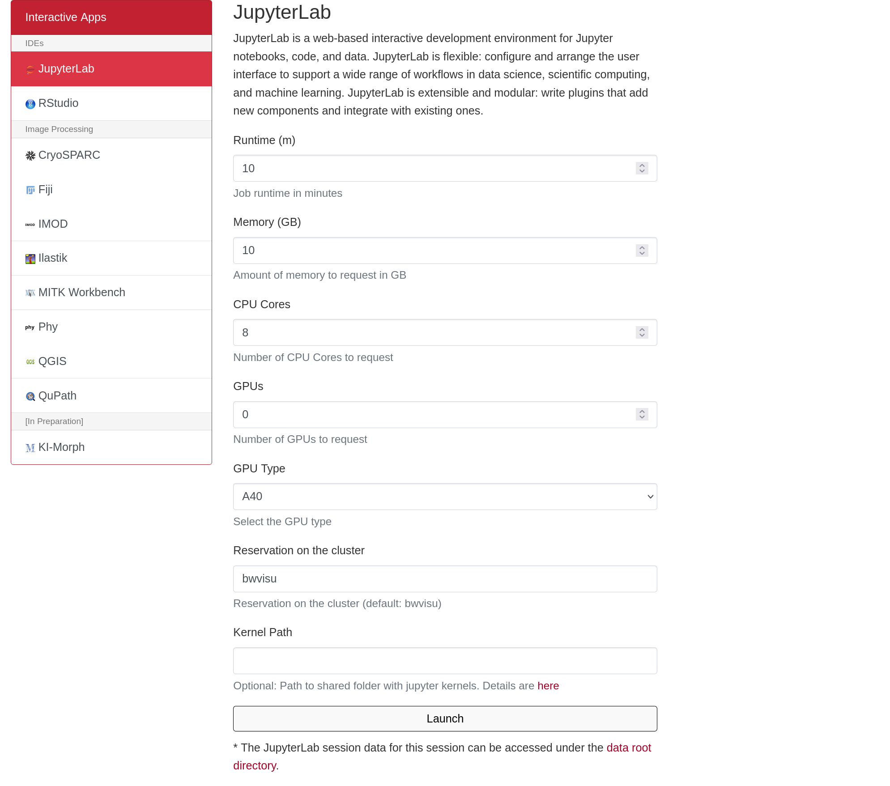
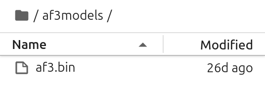
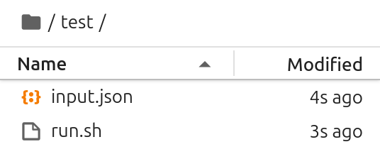
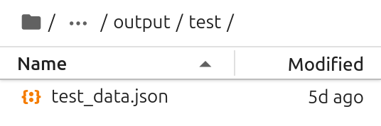
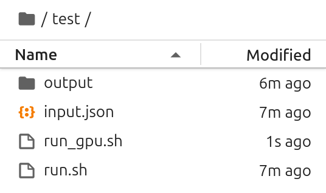
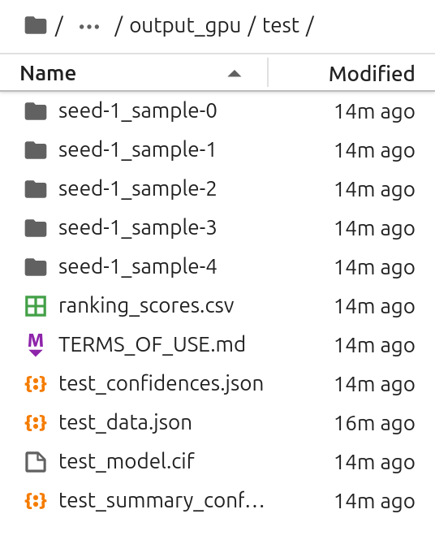
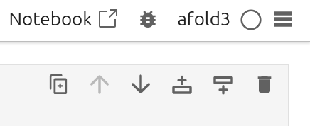

# AlphaFold 3 on bwVisu

Welcome to the AlphaFold Tutorial for bwVisu! 

This tutorial will guide you through running <a href="https://github.com/google-deepmind/alphafold3" target="_blank" rel="noopener">AlphaFold 3</a> on bwVisu. Please follow these steps carefully. Any feedback on the tutorial is welcome! Feel free to [contact us](../contact.md)!

## Preparation

### Step 1: Get access to bwVisu 

To start, get access to bwVisu via bwForCluster Helix or SDS. For more information, visit 

<a href="https://www.urz.uni-heidelberg.de/en/service-catalogue/software-and-applications/bwvisu" target="_blank" rel="noopener">https://www.urz.uni-heidelberg.de/en/service-catalogue/software-and-applications/bwvisu</a>

For technical questions regarding the high performance cluster, see <a href="https://bw-support.scc.kit.edu" target="_blank" rel="noopener">https://bw-support.scc.kit.edu</a>. Feel free to [contact us](../contact.md) for support.

### Step 2: Obtain Model Weights from AlphaFold 

Each user needs to individually obtain the model weights for AlphaFold3. Download the model weights from AlphaFold using this form:  

<a href="https://forms.gle/svvpY4u2jsHEwWYS6" target="_blank" rel="noopener">https://forms.gle/svvpY4u2jsHEwWYS6</a> 

Note that this can take up to a few days!

!!! danger  "Legal Note"

    Please note that your use of AlphaFold is subject to the terms and conditions outlined in the <a href="https://github.com/google-deepmind/alphafold3/blob/main/WEIGHTS_TERMS_OF_USE.md" target="_blank" rel="noopener">https://github.com/google-deepmind/alphafold3/blob/main/WEIGHTS_TERMS_OF_USE.md</a>. You are responsible for ensuring you comply with these terms.

## Part 1: Alignment

### Step 3: Connect to bwVisu and Start Jupyter 

Go to <a href="https://bwvisu.bwservices.uni-heidelberg.de/" target="_blank" rel="noopener">https://bwvisu.bwservices.uni-heidelberg.de/</a> and log in with your credentials and one-time password. 

Choose Jupyter and start a new session. Now you can select the resources you need.

The first step of the AlphaFold prediction is a multi-sequence alignment (MSA). For the MSA step, select 8 CPU cores with 10 GB of memory. The GPU necessary for the second step will be requested later. 

{:.invertable}
<!--{: style="height:500px;width:750px"}-->

Click on "Launch". This will bring you to a new screen showing your interactive sessions. Wait for your session to be ready, then click on "Connect to Jupyter". This brings you into a JupyterLab environment.

### Step 4: Set a Working Directory and Upload Files

First we need to define a working directory. That can be your `home` or any directory you create. These will contain all files necessary for the tutorial. A new directory can be created using folder icon on the top left of the file browser:

{: .invertable style="height:111px;width:444px"}

Next all required files need to be uploaded. This includes the notebooks from our <a href="https://github.com/ssciwr/BioStructureHub/tree/main/notebooks" target="_blank" rel="noopener">github</a> and the AlphaFold parameters. You can upload these files by clicking on the upload button:

{: .invertable style="height:111px;width:444px"}

Note that the AlphaFold parameter file is zipped as `af3.bin.zst`. Unpack the file to obtain `af3.bin`. This file then needs to be uploaded to a directory in your working directory, such as `/af3models`. 

{: .invertable style="height:95px;width:268px"}

After the upload, you can see your files in the file browser on the left.

### Step 5: Start the Alinment 

Open `Afold_Alignment_CPU.ipynb` and execute the cells in the notebook to start your AlphaFold run!

#### Verify Input

Before starting your AlphaFold 3 alignment you should see the following files in your working directory:

{: .invertable style="height:112px;width:268px"}

#### Verify Output 

In the output directory, there should be a second `.json` file in the `output/test` directory. This includes all the information from the input file and the results of the MSA. 

{: .invertable style="height:89px;width:268px"}

You can now close this interactive session session on bwVisu, as the CPU is no longer needed, and move to the second step.

 

## Part 2: Inference

### Step 6: Start a Second Jupyter Session

The second step of the AlphaFold prediction is the inference of the structure by the model, and it requires a GPU. Therefore we need another Jupyter session, where we need a GPU, so we need to request a GPU node on bwVisu. A list of available GPUs and their specifications is available at <a href="https://wiki.bwhpc.de/e/Helix/Hardware#Compute_Nodes" target="_blank" rel="noopener">https://wiki.bwhpc.de/e/Helix/Hardware#Compute_Nodes</a> , or in the table below.

{:.invertable}
<!--Cant I link this directly?-->

The GPU is selected by "GPU Type". The memory of each GPU Type is specified in GPU Memory per GPU (GB). For this example we select one of the A40 GPUs. Larger jobs (= longer sequences, more chains) require more memory. To access these, it is suggested to run the job directly on the Helix cluster. We will prepare a tutorial for this shortly - feel free to contact us!

{:.invertable}
<!--{: style="height:500px;width:750px"}-->

Click on "Launch". This will bring you to a new screen showing your interactive sessions. Wait for your session to be ready, then click on "Connect to Jupyter". This brings you into a JupyterLab environment.

### Step 7: Set Up Your Diffusion Run Within the Notebook
Open `AFold_Diffusion_GPU.ipynb`. We will use the same directories that you created earlier. Make sure to use the exact same names for directories as in `Afold_Alignment_CPU.ipynb`. 

Execute the cells in the notebook to continue your AlphaFold run!

#### Verify Input 

Before starting your AlphaFold 3 diffusion you should see the following files in your working directory:

{: .invertable style="height:159px;width:268px"}

#### Verify Output

You should see the AlphaFold output files:

{:.invertable  style="height:335px;width:268px"}

By default AlphaFold creates 5 samples from one seed, and sorts them in individual directories. Their ranking scores are reported in a csv table.
The best model is presented in the output directory as well, with its structure file and confidence descriptions. The latter are needed to judge the quality of the prediction.

!!! danger  "Legal Note"

    Please note that you must ensure your use and distribution of the AlphaFold outputs comply with the <a href="https://github.com/google-deepmind/alphafold3/blob/main/OUTPUT_TERMS_OF_USE.md" target="_blank" rel="noopener">Output Terms of Use</a>.

## Part 3: Analysis

### Step 8: Start another Jupyter Session

You can use `Afold_Confidence_Levels.ipynb` to get a summary of the models confidence levels. This notebook reads the confidence descriptions and renders its central information.

For this last notebook, you need to have access to a shared directory that includes libraries that are used to analyze and visualize the output. Start a new JupyterLab session and define the `Kernel Path` to the AlphaFold kernel at `/mnt/sds-hd/sd25g005/afold3/share/jupyter/`. [Contact us](../contact.md) for access to this shared directory.

{:.invertable}
<!--{: style="height:500px;width:750px"}-->

Click on "Launch". This will bring you to a new screen showing your interactive sessions. Wait for your session to be ready, then click on "Connect to Jupyter". This brings you into a JupyterLab environment.

### Step 9: Analyze your results

Open `Afold_Confidence_Levels.ipynb` and select the `afold3` kernel. You can verify the kernel in the top right corner of your JupyterLab instance:

{: .invertable style="width:232px"} 

After this, the analysis should run without any errors. Explanations of the output are provided in the notebook.

To visualize your predicted structures, download them to your computer and open the files with programs such as <a href="https://pymol.org/" target="_blank" rel="noopener">Pymol</a> or <a href="https://www.cgl.ucsf.edu/chimerax/" target="_blank" rel="noopener">ChimeraX</a>. To visualize the pIDDT in "classic" AlphaFold colors, use <a href="https://kpwulab.com/2023/03/09/color-alphafold2s-plddt/" target="_blank" rel="noopener">this</a> quick tutorial. This allows to visualize more and less confident areas of the predicted structure.

If you need more assistance with the analysis, feel free to [contact us](../contact.md).

### References

<a href="https://www.nature.com/articles/s41586-024-07487-w" target="_blank" rel="noopener">https://www.nature.com/articles/s41586-024-07487-w</a>

<a href="https://github.com/google-deepmind/alphafold3" target="_blank" rel="noopener">https://github.com/google-deepmind/alphafold3</a>