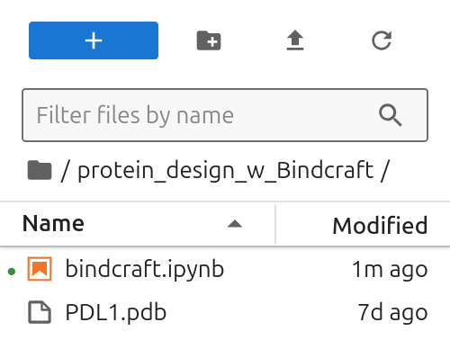

# Bindcraft on bwVisu

Welcome to the Bindcraft Tutorial for bwVisu! 

### Step 1: Get access to bwVisu 

To start, get access to bwVisu via bwForCluster Helix or SDS. For more information, visit 

[https://www.urz.uni-heidelberg.de/en/service-catalogue/software-and-applications/bwvisu](https://www.urz.uni-heidelberg.de/en/service-catalogue/software-and-applications/bwvisu) 

For technical questions regarding the high performance cluster, see [https://bw-support.scc.kit.edu](https://bw-support.scc.kit.edu). Feel free to [contact us](/contact) for support.

### Step 2: Connect to bwVisu and Start Jupyter 

Go to [https://bwvisu.bwservices.uni-heidelberg.de/](https://bwvisu.bwservices.uni-heidelberg.de/ ) and log in with your credentials and one-time password. Please note that you need to be connected to Heidelberg University's VPN if you are connecting from outside the campus.

Choose Jupyter and start a new session.  

To use Bindcraft, we need to request a GPU core of type A40. 
Choose the Kernel Path to Bindcraft:
./mnt/sds-hd/sd25g005/bindcraft/share/jupyter/

<!--{: style="height:500px;width:750px"}-->

Click on "Launch". This will bring you to a new screen showing your interactive sessions. Wait for your session to be ready, then click on "Connect to Jupyter". This brings you into a JupyterLab environment.

Upload the notebooks in (link) and the [PLD1.pdb](https://www.rcsb.org/structure/PLD1) file by clicking on the upload button:

{: style="height:111px;width:444px"}

After the upload, you can see the notebooks in the file browser on the left.

{: style="width:268px"}

### Step 3: Prepare Modules and Environments
Load the GNU compiler module for fortran libraries, by clicking on the hexagon on the right and selecting compiler/gnu/11.3
Open the notebook. Check if module list and lib dir works by executing the first cells.
If the notebook was open before, restart Kernel.

{: style="width:268px"}

### Step 4: Start the Calculation

Now execute the cells in the notebook to start your Boltzgen run!