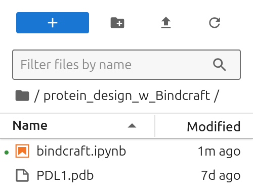
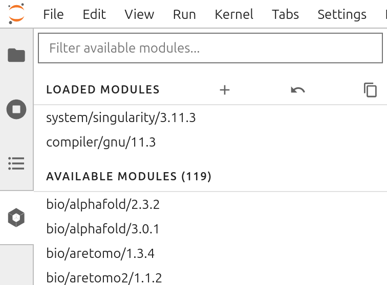
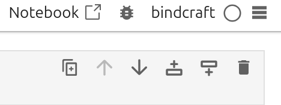
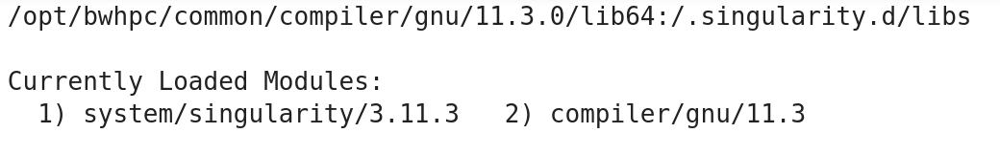
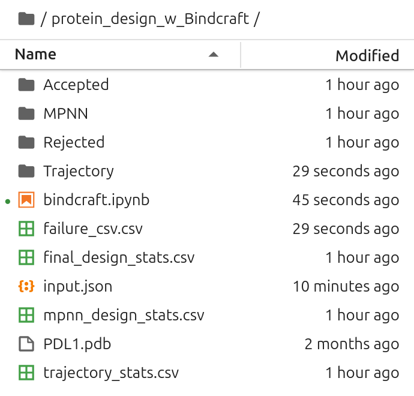

# BindCraft on bwVisu

Welcome to the BindCraft Tutorial for bwVisu!  

This tutorial will guide you through running <a href="https://github.com/martinpacesa/BindCraft" target="_blank" rel="noopener">BindCraft</a> on bwVisu. Please follow these steps carefully. Any feedback on the tutorial is welcome! Feel free to [contact us](../contact.md)!

### Step 1: Get access to bwVisu 

To start, get access to bwVisu via bwForCluster Helix or SDS. For more information, visit 

<a href="https://www.urz.uni-heidelberg.de/en/service-catalogue/software-and-applications/bwvisu" target="_blank" rel="noopener">https://www.urz.uni-heidelberg.de/en/service-catalogue/software-and-applications/bwvisu</a>

For technical questions regarding the high performance cluster, see <a href="https://bw-support.scc.kit.edu" target="_blank" rel="noopener">https://bw-support.scc.kit.edu</a>. Feel free to [contact us](../contact.md) for support.

### Step 2: Connect to bwVisu and Start Jupyter 

Go to [https://bwvisu.bwservices.uni-heidelberg.de/](https://bwvisu.bwservices.uni-heidelberg.de/ ) and log in with your credentials and one-time password. 

Choose Jupyter and start a new session. Now you can select the resources you need.

Bindcraft needs a GPU to run in the cluster. A list of available GPUs and their specifications is available at <a href="https://wiki.bwhpc.de/e/Helix/Hardware#Compute_Nodes" target="_blank" rel="noopener">https://wiki.bwhpc.de/e/Helix/Hardware#Compute_Nodes</a>, or in the table below.

<!--Cant I link this directly?-->

The GPU is selected byw "GPU Type". The memory of each GPU Type is specified in GPU Memory per GPU (GB). For this example we select one of the A40 GPUs. Larger jobs (= longer sequences, more chains) require more memory. To access these, it is suggested to run the job directly on the Helix cluster. Feel free to contact us, if you need assistance!

Choose the Kernel Path to Bindcraft: `/mnt/sds-hd/sd25g005/bindcraft/share/jupyter/` [Contact us](../contact.md) for access to this shared directory.

<!--{: style="height:500px;width:750px"}-->

Click on "Launch". This will bring you to a new screen showing your interactive sessions. Wait for your session to be ready, then click on "Connect to Jupyter". This brings you into a JupyterLab environment.

### Step 3: Set a Working Directory and Upload Files

Now we need to define a working directory. These will contain all files necessary for the tutorial. A new directory can be created using folder icon on the top left of the file browser:

{: style="height:111px;width:444px"}

Upload the notebooks from <a href="https://github.com/ssciwr/BioStructureHub/tree/protein_design/notebooks" target="_blank" rel="noopener">our github</a> and the <a href="https://github.com/martinpacesa/BindCraft/blob/main/example/PDL1.pdb" target="_blank" rel="noopener">PDL1.pdb</a> file by clicking on the upload button:

{: style="height:111px;width:444px"}

After the upload, you can see the notebooks in the file browser on the left.

{: style="width:268px"}

### Step 3: Prepare Modules and Environments
Load the GNU compiler module for fortran libraries, by clicking on the hexagon on the right and selecting `compiler/gnu/11.3`. You should see them as loaded modules like so:

{: style="width:378px"}

Open `Bindcraft.ipynb` and select the `Bindcraft` kernel. You can verify the kernel in the top right corner of your JupyterLab instance:

{: style="width:232px"} 

In the notebook you can check the modules by checking the output of `! module list` which should look like that:

{: style="width:520px"}

If you can see the modules in your module list at the top right, but not listed in the notebook, restart the kernel and execute all cells until this step again:

{: style="width:268px"}

### Step 5: Start the Calculation

Now execute the other cells in the notebook to start your BindCraft run!

#### Verify Input

Before starting your BindCraft run you should see the following files in your working directory:

{: style="width:268px"}

#### Verify Output 

In the output directory, there should be multiple files. The .cif file includes the structure, the other files are used to determine the quality of the prediction. 

{: style="width:268px"}

If you need more assistance with the analysis, feel free to [contact us](../contact.md).

### References

<a href="https://www.biorxiv.org/content/10.1101/2024.09.30.615802v3" target="_blank" rel="noopener">https://www.biorxiv.org/content/10.1101/2024.09.30.615802v3</a>

<a href="https://github.com/martinpacesa/BindCraft" target="_blank" rel="noopener">https://github.com/martinpacesa/BindCraft</a>