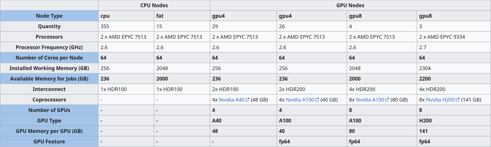
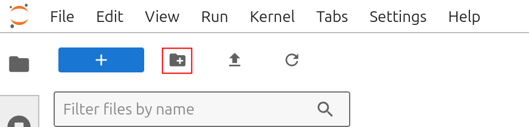
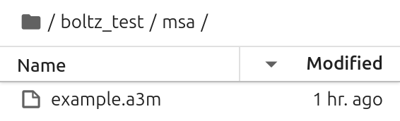
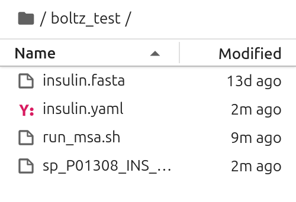
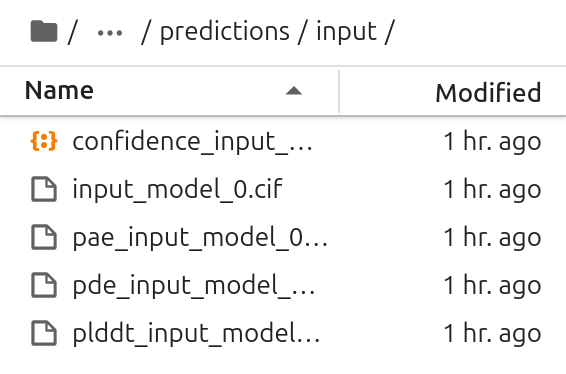

# Boltz-2 on bwVisu

Welcome to the Boltz-2 Tutorial for bwVisu!  

<a href="https://github.com/jwohlwend/boltz" target="_blank" rel="noopener">Boltz-2</a> is an open-source biomolecular foundation model to predict 3D structures of biomolecular complexes and binding affinities. This tutorial will guide you through running Boltz-2 on bwVisu. Please follow these steps carefully. Any feedback on the tutorial is welcome! Feel free to [contact us](../contact.md)!

### Step 1: Get access to bwVisu 

To start, get access to bwVisu via bwForCluster Helix or SDS. For more information, visit 

<a href="https://www.urz.uni-heidelberg.de/en/service-catalogue/software-and-applications/bwvisu" target="_blank" rel="noopener">https://www.urz.uni-heidelberg.de/en/service-catalogue/software-and-applications/bwvisu</a>

For technical questions regarding the high performance cluster, see <a href="https://bw-support.scc.kit.edu" target="_blank" rel="noopener">https://bw-support.scc.kit.edu</a>. Feel free to [contact us](../contact.md) for support.

### Step 2: Prepare the Multisequence Alignment 

The first step of the structure prediction is a multi-sequence alignment (MSA), which provides the basis for the prediction. Boltz relies on external partner, such as the <a href="https://www.nature.com/articles/s41592-022-01488-1" target="_blank" rel="noopener">colabfold</a> server. To run Boltz on bwVisu, a precomputed MSA file for any given input sequence needs to be provided. You can calculate the MSA locally using <a href="https://github.com/soedinglab/MMseqs2" target="_blank" rel="noopener">mmseqs2</a>. For this tutorial you can download the `example.a3m` file from our <a href="https://github.com/ssciwr/BioStructureHub/tree/main/notebooks" target="_blank" rel="noopener">github</a>. 

### Step 3: Connect to bwVisu and Start Jupyter 

Go to <a href="https://bwvisu.bwservices.uni-heidelberg.de/" target="_blank" rel="noopener">https://bwvisu.bwservices.uni-heidelberg.de/</a> and log in with your credentials and one-time password. 

Choose Jupyter and start a new session. Now you can select the resources you need.

For the inference step we need a GPU, so we need to request a GPU node on bwVisu. A list of available GPUs and their specifications is available at <a href="https://wiki.bwhpc.de/e/Helix/Hardware#Compute_Nodes" target="_blank" rel="noopener">https://wiki.bwhpc.de/e/Helix/Hardware#Compute_Nodes</a>, or in the table below.

<!--Cant I link this directly?-->

The GPU is selected byw "GPU Type". The memory of each GPU Type is specified in GPU Memory per GPU (GB). For this example we select one of the A40 GPUs. Larger jobs (= longer sequences, more chains) require more memory. To access these, it is suggested to run the job directly on the Helix cluster. We will prepare a tutorial for this shortly - feel free to contact us!

You also need to define the `Kernel Path` to the boltz kernel at `/mnt/sds-hd/sd25g005/boltzgen/share/jupyter/`. [Contact us](../contact.md) for access to this shared directory.

<!--{: style="height:500px;width:750px"}-->

Click on "Launch". This will bring you to a new screen showing your interactive sessions. Wait for your session to be ready, then click on "Connect to Jupyter". This brings you into a JupyterLab environment.

### Step 4: Set a Working Directory and Upload Files

Now we need to define a working directory. These will contain all files necessary for the tutorial. A new directory can be created using folder icon on the top left of the file browser:

{: style="height:111px;width:444px"}

Download the tutorial notebooks from our <a href="https://github.com/ssciwr/BioStructureHub/tree/main/notebooks" target="_blank" rel="noopener">github</a>. Upload the notebook and the `example.a3m` file by clicking on the upload button:

{: style="height:111px;width:444px"}

After the upload, you can see the notebooks in the file browser on the left:

{: style="width:268px"} 

### Step 5: Open the Notebook and Start the Calculation

 Open `Boltz_input.ipynb` and select the `boltz` kernel. You can verify the kernel in the top right corner of your JupyterLab instance:

 {: style="width:232px"} 

Now execute the cells in the notebook to start your Boltz run!

#### Verify Input

Before starting your Boltz prediction you should see the following files in your working directory:

{: style="width:268px"}

#### Verify Output 

In the output directory, there should be multiple files. The .cif file includes the structure, the other files are used to determine the quality of the prediction. 

{: style="width:268px"}

### Step 6: Analyze your results

Open the second notebook called `Boltz_Confidence_Levels.ipynb` to get a summary of the models confidence levels. This notebook reads the confidence descriptions and renders its central information.

To find the files, you need the name of the input file of the Boltz run and your working directory. In this example we used `input_file.yaml`, so the directory structure `input_file` is automatically created.

To visualize your predicted structures, download them to your computer and open the files with programs such as <a href="https://pymol.org/" target="_blank" rel="noopener">Pymol</a> or <a href="https://www.cgl.ucsf.edu/chimerax/" target="_blank" rel="noopener">ChimeraX</a>. To visualize the pIDDT in "classic" AlphaFold colors, use <a href="https://kpwulab.com/2023/03/09/color-alphafold2s-plddt/" target="_blank" rel="noopener">this</a> quick tutorial. This allows to visualize more and less confident areas of the predicted structure.

If you need more assistance with the analysis, feel free to [contact us](../contact.md).

### References

<a href="https://www.biorxiv.org/content/10.1101/2025.06.14.659707v1" target="_blank" rel="noopener">https://www.biorxiv.org/content/10.1101/2025.06.14.659707v1</a>

<a href="https://github.com/jwohlwend/boltz" target="_blank" rel="noopener">https://github.com/jwohlwend/boltz</a>