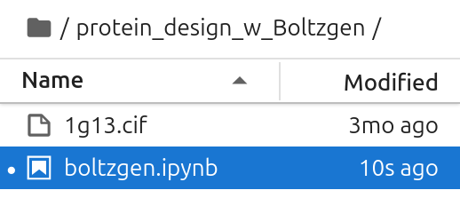

# Boltzgen on bwVisu

Welcome to the Boltzgen Tutorial for bwVisu! 

### Step 1: Get access to bwVisu 

To start, get access to bwVisu via bwForCluster Helix or SDS. For more information, visit 

<a href="https://www.urz.uni-heidelberg.de/en/service-catalogue/software-and-applications/bwvisu" target="_blank" rel="noopener">https://www.urz.uni-heidelberg.de/en/service-catalogue/software-and-applications/bwvisu</a> 

For technical questions regarding the high performance cluster, see <a href="https://bw-support.scc.kit.edu" target="_blank" rel="noopener">https://bw-support.scc.kit.edu</a>. Feel free to [contact us](../contact.md) for support.

### Step 2: Start the calculation

Request a GPU core of type A40. Choose the Kernel Path to Boltzen `/mnt/sds-hd/sd25g005/boltzgen/share/jupyter/` [Contact us](../contact.md) for access to this shared directory.

<!--{: style="height:500px;width:750px"}-->

Click on "Launch". This will bring you to a new screen showing your interactive sessions. Wait for your session to be ready, then click on "Connect to Jupyter". This brings you into a JupyterLab environment.

Upload the notebooks from our <a href="https://github.com/ssciwr/BioStructureHub/tree/main/notebooks" target="_blank" rel="noopener">github</a> and the <a href="https://www.rcsb.org/structure/1G13" target="_blank" rel="noopener">1g13.cif</a> file by clicking on the upload button:

{: style="height:111px;width:444px"}

After the upload, you can see the notebooks in the file browser on the left. 

{: style="width:268px"}

Now execute the cells in the notebook to start your Boltzgen run!
