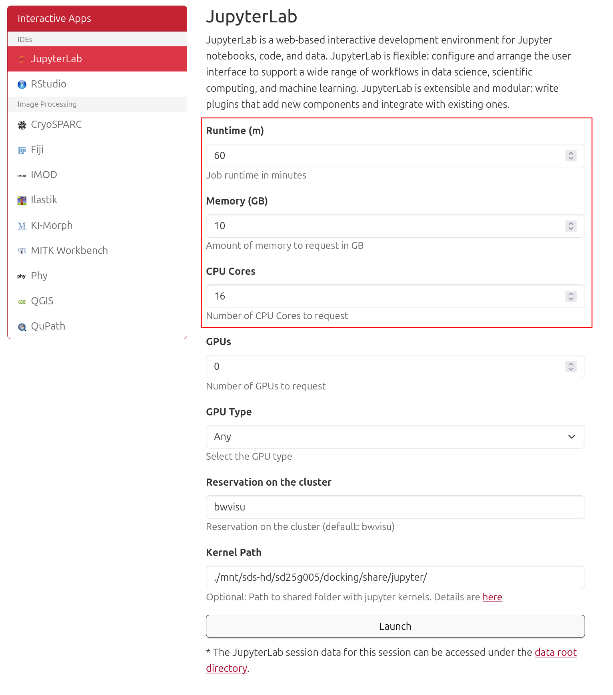
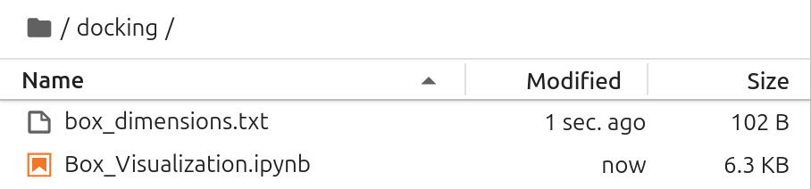
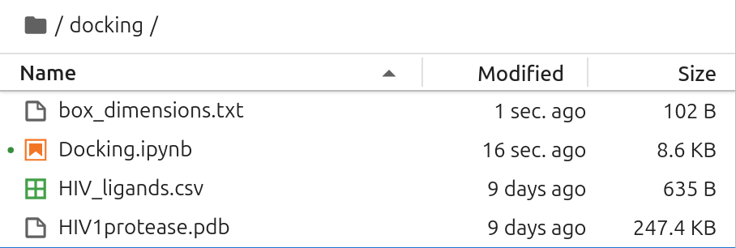

# Small Molecule Docking on bwVisu

Welcome to the Dokcing Tutorial for bwVisu! 

This tutorial will guide you through running quick docking example on bwVisu. Please follow these steps carefully. Any feedback on the tutorial is welcome! Feel free to [contact us](../contact.md)!

This tutorial can be used based on an existing experimental structure or as a follow up to a structure prediction using either [AlphaFold](/docs/tutorials/tutorial_AF_bwVisu.md) or [Boltz](/docs/tutorials/tutorial_Boltz_bwVisu.md). Make sure to consider the  <a href="https://github.com/google-deepmind/alphafold3/blob/main/OUTPUT_TERMS_OF_USE.md" target="_blank" rel="noopener">Output Terms of Use</a> if your work with AlphaFold3.

Note that only small molecules can be treated with this workflow. If you have more complex systems, [contact us](../contact.md) to discuss a solution.

### Step 1: Prepare your Protein Input

You can start the docking experiment from an experimental structure from the <a href="https://www.rcsb.org/" target="_blank" rel="noopener">Protein Data Bank</a> or from a structure prediction. If your structure contains more than just the target protein, open your file with an editor e.g. <a href="https://pymol.org/" target="_blank" rel="noopener">Pymol</a> or <a href="https://www.cgl.ucsf.edu/chimerax/" target="_blank" rel="noopener">ChimeraX</a> and remove anything unnecessary, such as waters, small molecules, or native ligands. For experimental structures, you need to add Hydrogens. Save the resulting structure as `.pdb` or `.cif`.

If you start from a structure prediction with only the protein, you can use the `.pdb` or `.cif` file directly, as it contains Hydrogens already.

### Step 2: Find Ligands to Dock

You can dock more than one ligand at a time. The tutorial notebook expects a list of ligands in SMILES format, in a `.csv` table. You can save any `Excel` table in `.csv` format. Just make sure, one of the columns is called "smiles".

Feel free to look at the example in our GitHub!

### Step 3: Access bwVisu and Start Jupyter

Go to <a href="https://bwvisu.bwservices.uni-heidelberg.de/" target="_blank" rel="noopener">https://bwvisu.bwservices.uni-heidelberg.de/</a> and log in with your credentials and one-time password. 

Choose Jupyter and start a new session. Now you can select the resources you need. While Vina can utilize GPUs, we use the CPU Version to go to a faster Queue on the Helix cluster. So do **not** request a GPU!

You also need access to the python environment, so set the `Kernel Path` to the OpenMM kernel at `/mnt/sds-hd/sd25g005/docking/share/jupyter/`. 

{:.invertable}
<!--{: style="height:500px;width:750px"}-->

Click on "Launch". This will bring you to a new screen showing your interactive sessions. Wait for your session to be ready, then click on "Connect to Jupyter". This brings you into a JupyterLab environment.

### Step 4: Go to your Working Directory and Upload Files

Next all required files need to be present in the same directory as your structure. Take the notebooks from our <a href="https://github.com/ssciwr/BioStructureHub/tree/main/notebooks" target="_blank" rel="noopener">github</a> and upload them by clicking on the upload button:

{: .invertable style="height:111px;width:444px"}

Upload your clean receptor and ligand table into the same directory as the `Docking.ipynb` notebook. 

!!! note "Hint:"
    If you do not know where to place the box, look at our `Box_Visualization.ipynb` notebook. You can visualize your receptor and possible box positions using bwVisu. And it creates the `box_dimensions.txt` file for you!

    {: .invertable style="height:142px"}

Finally your input files should look like:

{: .invertable style="height:142px"}

### Step 5: Start the Simulation

Open `Doocking.ipynb`, add your `.pdb` or`.cif` file, as well as your `.csv` file in the notebook and then execute all the cells in the notebook to start your Docking run! Remember to set the kernel in the top right of the notebook to "docking".

### References

 <a href="https://autodock-vina.readthedocs.io/en/latest/docking_basic.html" target="_blank" rel="noopener">https://autodock-vina.readthedocs.io/en/latest/docking_basic.html</a>