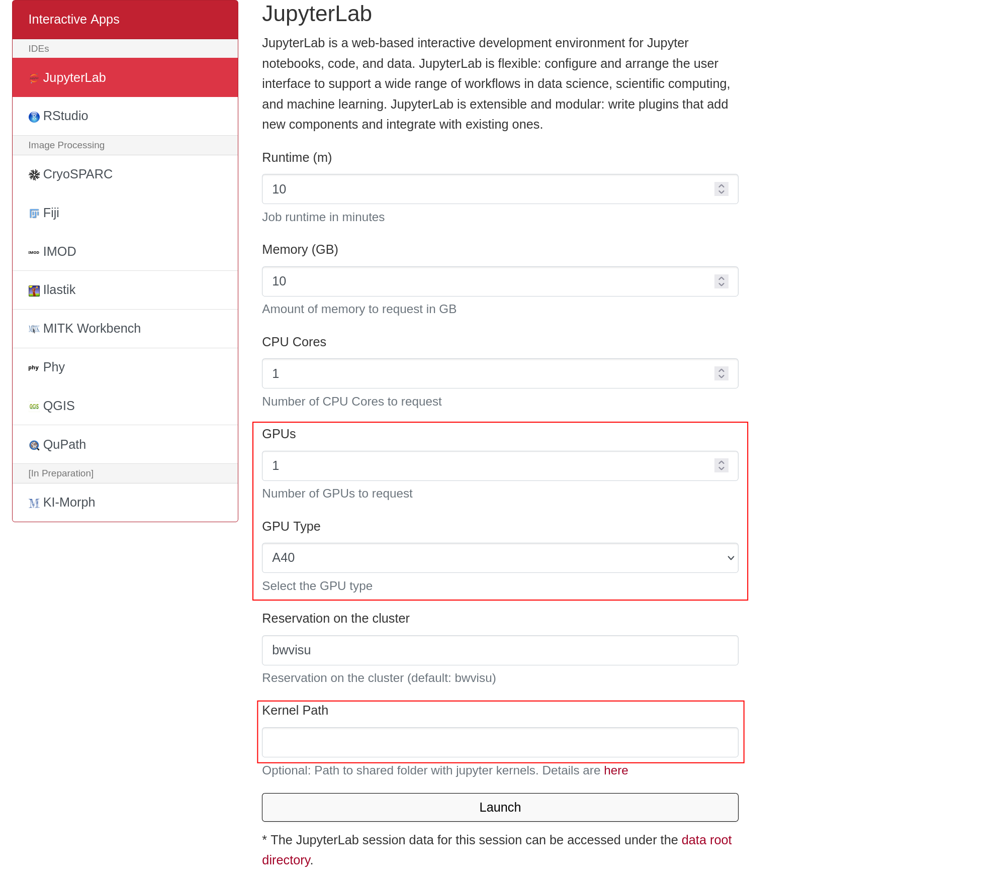
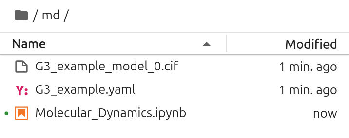

# Molecular Dynamics on bwVisu

Welcome to the Molecular Dynamics Tutorial for bwVisu! 

This tutorial will guide you through running short Molecular Dynamics Simulation on bwVisu. Please follow these steps carefully. Any feedback on the tutorial is welcome! Feel free to [contact us](../contact.md)!

This tutorial is intended as a follow up to a structure prediction using either [AlphaFold](/docs/tutorials/tutorial_AF_bwVisu.md) or [Boltz](/docs/tutorials/tutorial_Boltz_bwVisu.md). 

### Step 1: Access bwVisu and Start Jupyter

Go to <a href="https://bwvisu.bwservices.uni-heidelberg.de/" target="_blank" rel="noopener">https://bwvisu.bwservices.uni-heidelberg.de/</a> and log in with your credentials and one-time password. 

Choose Jupyter and start a new session. Now you can select the resources you need.

For the Molecular Dynamics Simulation we will need a GPU of type A40.

You also need access to the python environment, so set the `Kernel Path` to the OpenMM kernel at `/mnt/sds-hd/sd25g005/openmm/share/jupyter/`. 

{:.invertable}
<!--{: style="height:500px;width:750px"}-->

Click on "Launch". This will bring you to a new screen showing your interactive sessions. Wait for your session to be ready, then click on "Connect to Jupyter". This brings you into a JupyterLab environment.

### Step 2: Go to your Working Directory and Upload Files

Next all required files need to be present in the same directory as your predicted structure. Take the Molecular Dynamics notebook from our <a href="https://github.com/ssciwr/BioStructureHub/tree/main/notebooks" target="_blank" rel="noopener">github</a> and upload them by clicking on the upload button:

{: .invertable style="height:111px;width:444px"}

Make sure that the output of your structure prediction is in the same directory as the `Molecular_Dynamics.ipynb` notebook. 

- if you ran an **AlphaFold** prediction, you just need the `.cif` file
- if you ran a **Boltz** prediction, you need the `.cif` file and the input `.yaml` file

It should look like this:

{: .invertable style="height:142px"}

### Step 3: Start the Simulation

Open `Molecular_Dynamics.ipynb`, add your `.cif` file (and in case of Boltz you input `.yaml`) in the notebook and then execute all the cells in the notebook to start your Molecular Dynamics run!
