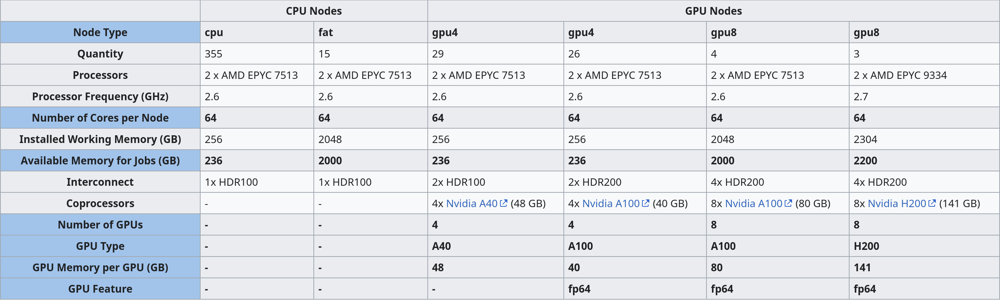
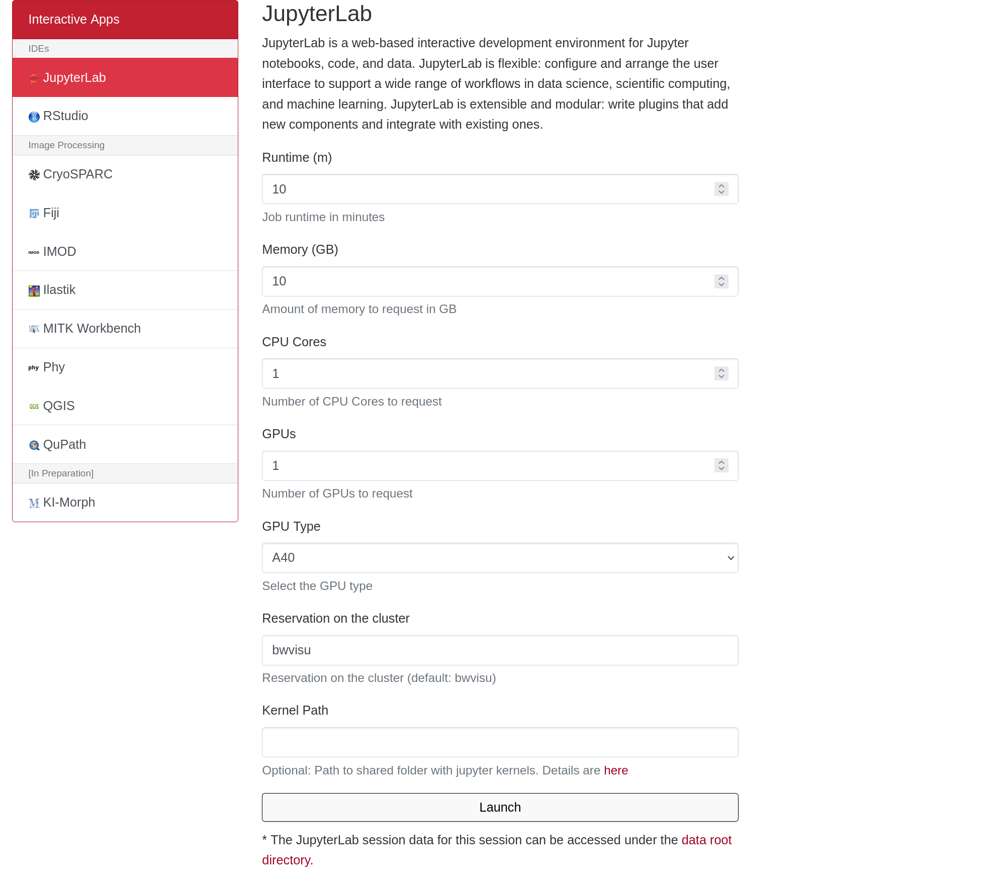
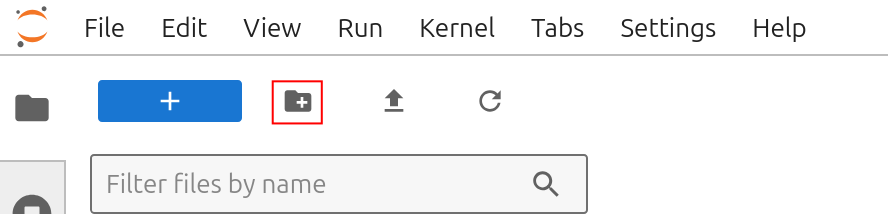
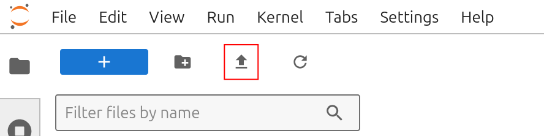
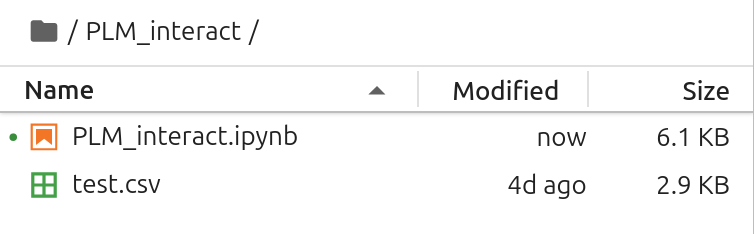
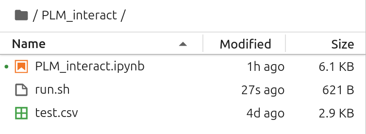
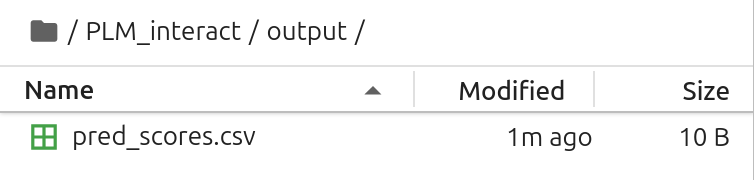
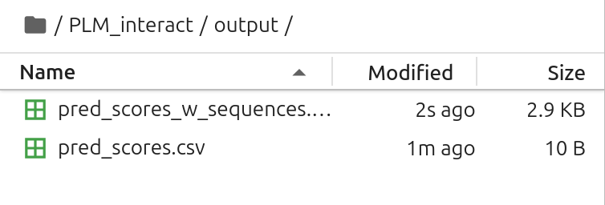

# PLM-Interact on bwVisu

Welcome to the PLM-interact Tutorial for bwVisu!  

<a href="https://github.com/liudan111/PLM-interact" target="_blank" rel="noopener">PLM-interact</a> is an open-source protein language model that predicts whether two proteins can interact from their sequences. This tutorial will guide you through running PLM-interact on bwVisu. Please follow these steps carefully. Any feedback on the tutorial is welcome! Feel free to [contact us](../contact.md)!

### Step 1: Get access to bwVisu 

To start, get access to bwVisu via bwForCluster Helix or SDS. For more information, visit 

<a href="https://www.urz.uni-heidelberg.de/en/service-catalogue/software-and-applications/bwvisu" target="_blank" rel="noopener">https://www.urz.uni-heidelberg.de/en/service-catalogue/software-and-applications/bwvisu</a> 

For technical questions regarding the high performance cluster, see <a href="https://bw-support.scc.kit.edu" target="_blank" rel="noopener">https://bw-support.scc.kit.edu</a>. Feel free to [contact us](../contact.md) for support.

### Step 2: Connect to bwVisu and Start Jupyter 

Go to <a href="https://bwvisu.bwservices.uni-heidelberg.de/" target="_blank" rel="noopener">https://bwvisu.bwservices.uni-heidelberg.de/</a> and log in with your credentials and one-time password. 

Choose Jupyter and start a new session. Now you can select the resources you need.

For the inference model in PLM-interact we need a GPU. A list of available GPUs and their specifications is available at <a href="https://wiki.bwhpc.de/e/Helix/Hardware#Compute_Nodes" target="_blank" rel="noopener">https://wiki.bwhpc.de/e/Helix/Hardware#Compute_Nodes</a>, or in the table below.

{:.invertable}
<!--Cant I link this directly?-->

The GPU is selected by "GPU Type". The memory of each GPU Type is specified in GPU Memory per GPU (GB). For this example we select one of the A40 GPUs. Larger jobs (= longer sequences, more chains) require more memory. To access these, it is suggested to run the job directly on the Helix cluster. Feel free to contact us, if you need assistance!

<!-- no need for kernel this time -->

{:.invertable}
<!--{: style="height:500px;width:750px"}-->

Click on "Launch". This will bring you to a new screen showing your interactive sessions. Wait for your session to be ready, then click on "Connect to Jupyter". This brings you into a JupyterLab environment.

### Step 3: Set a Working Directory and Upload Files

Now we need to define a working directory. These will contain all files necessary for the tutorial. A new directory can be created using folder icon on the top left of the file browser:

{: .invertable style="height:111px;width:444px"}

#### Input Sequences in `.csv` Format
PLM-interact reads the input sequence pairs from a `.csv` file. More information can be found <a href="https://github.com/liudan111/PLM-interact/tree/main#1-ppi-inference-with-multi-gpus" target="_blank" rel="noopener">here</a>.

| query   | text |
| -------- | ------- |
| {sequence1}  | {sequence2} |

If you copy these from `.fasta` files, make sure that there are no spaces within the sequences.

Upload the PLM-interact notebook from our <a href="https://github.com/ssciwr/BioStructureHub/tree/main/notebooks" target="_blank" rel="noopener">github</a> and the `.csv` file by clicking on the upload button:

{: .invertable style="height:111px;width:444px"}

After the upload, you can see the notebooks in the file browser on the left. 

{: .invertable style="width:377px"}

### Step 4: Open the Notebook and Start the Calculation

Open `PLM_interact.ipynb` and  execute the cells in the notebook to start your Boltzgen run!

#### Verify Input

Before starting your Boltz prediction you should see the following files in your working directory:

{:.invertable  style="width:377px"}

#### Verify Output 

In the output directory, there will be a `.csv` file with the output scores. For more information on the scoring, see the PLM-interact  <a href="https://www.nature.com/articles/s41467-025-64512-w" target="_blank" rel="noopener">publication</a>.

{:.invertable  style="width:377px"}

Note that the entries in the output `.csv` file are in the same order as the input sequence pairs. In the tutorial `.ipynb` we include a simple cell to merge the input sequences and output scores, if you prefer this:

{:.invertable  style="width:377px"}

### References

<a href="https://www.nature.com/articles/s41467-025-64512-w" target="_blank" rel="noopener">https://www.nature.com/articles/s41467-025-64512-w</a>

<a href="https://github.com/liudan111/PLM-interact" target="_blank" rel="noopener">https://github.com/liudan111/PLM-interact</a>

<a href="https://huggingface.co/danliu1226/PLM-interact-650M-humanV11" target="_blank" rel="noopener">https://huggingface.co/danliu1226/PLM-interact-650M-humanV11</a>

<a href="https://huggingface.co/facebook/esm2_t33_650M_UR50D" target="_blank" rel="noopener">https://huggingface.co/facebook/esm2_t33_650M_UR50D</a>
