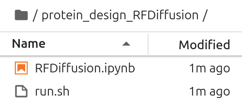

# RFDiffusion on bwVisu

Welcome to the RFDifusion Tutorial on bwVisu!

<a href="https://github.com/RosettaCommons/RFdiffusion" target="_blank" rel="noopener">RFDiffusion</a> is an open-source method for structure generation of proteins, peptides and antibodies. This tutorial will guide you through running RFDiffusion on bwVisu. Please follow these steps carefully. Any feedback on the tutorial is welcome! Feel free to [contact us](../contact.md)!

### Step 1: Get access to bwVisu 

To start, get access to bwVisu via bwForCluster Helix or SDS. For more information, visit 

<a href="https://www.urz.uni-heidelberg.de/en/service-catalogue/software-and-applications/bwvisu" target="_blank" rel="noopener">https://www.urz.uni-heidelberg.de/en/service-catalogue/software-and-applications/bwvisu</a>

For technical questions regarding the high performance cluster, see <a href="https://bw-support.scc.kit.edu" target="_blank" rel="noopener">https://bw-support.scc.kit.edu</a>. Feel free to [contact us](../contact.md) for support.

### Step 2: Connect to bwVisu and Start Jupyter 

Go to [https://bwvisu.bwservices.uni-heidelberg.de/](https://bwvisu.bwservices.uni-heidelberg.de/ ) and log in with your credentials and one-time password. 

Choose Jupyter and start a new session. Now you can select the resources you need.

RFDiffusion needs a GPU to run in the cluster. A list of available GPUs and their specifications is available at <a href="https://wiki.bwhpc.de/e/Helix/Hardware#Compute_Nodes" target="_blank" rel="noopener">https://wiki.bwhpc.de/e/Helix/Hardware#Compute_Nodes</a>, or in the table below.

<!--Cant I link this directly?-->

The GPU is selected byw "GPU Type". The memory of each GPU Type is specified in GPU Memory per GPU (GB). For this example we select one of the A40 GPUs. Larger jobs (= longer sequences, more chains) require more memory. To access these, it is suggested to run the job directly on the Helix cluster. Feel free to contact us, if you need assistance!

<!--No Kernel needed-->

<!--{: style="height:500px;width:750px"}-->

Click on "Launch". This will bring you to a new screen showing your interactive sessions. Wait for your session to be ready, then click on "Connect to Jupyter". This brings you into a JupyterLab environment.

### Step 3:  Set a Working Directory and Upload Files

Now we need to define a working directory. These will contain all files necessary for the tutorial. A new directory can be created using folder icon on the top left of the file browser:

{: style="height:111px;width:444px"}

Upload the notebooks from our <a href="https://github.com/ssciwr/BioStructureHub/tree/main/notebooks" target="_blank" rel="noopener">github</a> by clicking on the upload button:

{: style="height:111px;width:444px"}

After the upload, you can see the notebooks in the file browser on the left.

Note that you do not need further files or examples, as they are stored on Helix for you.

### Step 4: Prepare Environments and Start the Calculation
Open `RFDiffusion.ipynb`.  <!--No Kernel needed-->

Load the RFDiffusion module by clicking on the hexagon on the right and selecting `bio/rfdiffusion`.
Open the notebook. Check if module list works by executing the first cells.
If the notebook was open before, restart the kernel.

{: style="width:268px"}

Execute the steps in the notebook to start the calculation. 

#### Verify Input

Before starting your Boltz prediction you should see the following files in your working directory:

{: style="width:268px"}

#### Verify Output

Once the calculation is done you will see the files in your `WORKING_DIR`:

{: style="width:268px"}

You can find your results in the `outputs` directory. For more information, please refer to the <a href="https://github.com/RosettaCommons/RFdiffusion" target="_blank" rel="noopener">RFDiffusion documentation</a>.

If you need more assistance with the analysis, feel free to [contact us](../contact.md).

### References

<a href="https://www.nature.com/articles/s41586-023-06415-8" target="_blank" rel="noopener">https://www.nature.com/articles/s41586-023-06415-8</a>

<a href="https://github.com/RosettaCommons/RFdiffusion" target="_blank" rel="noopener">https://github.com/RosettaCommons/RFdiffusion</a>