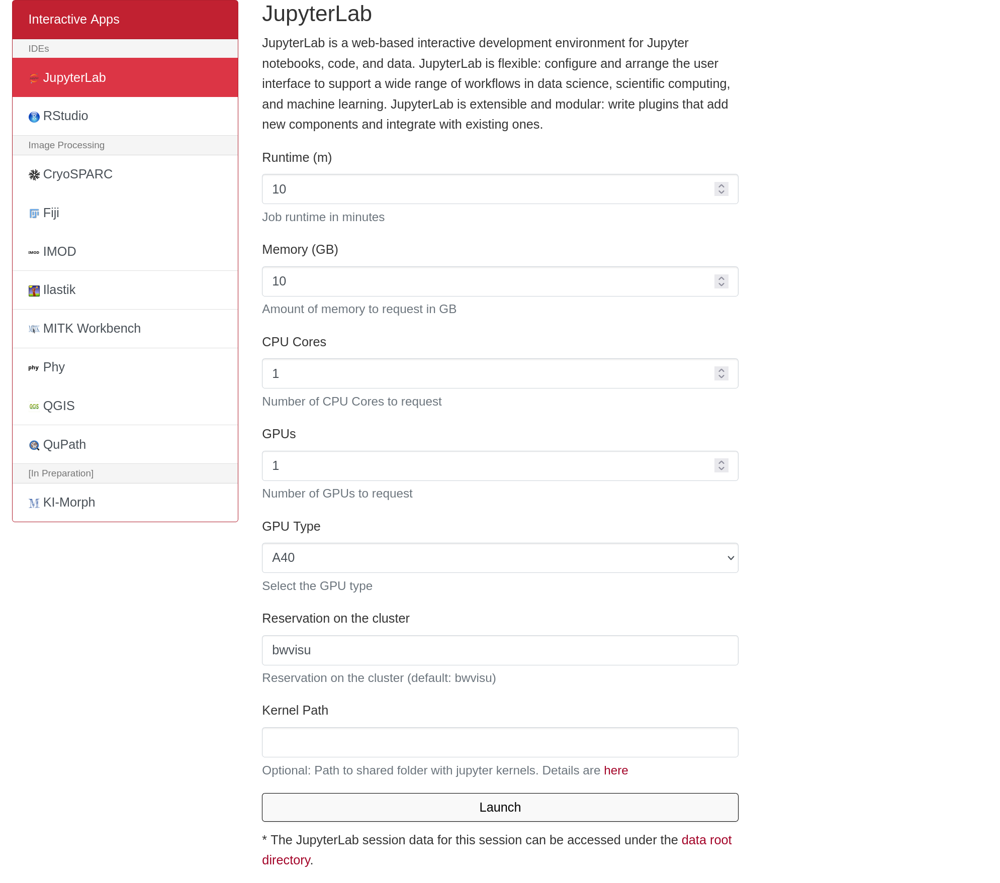
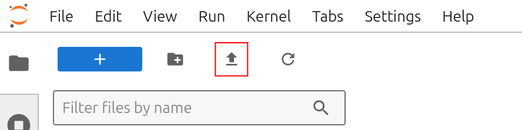
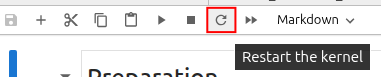
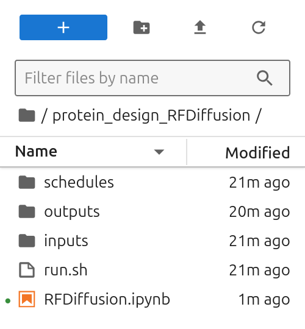

# RFDiffusion on bwVisu

Welcome to the [RFDiffusion](https://github.com/RosettaCommons/RFdiffusion) Tutorial for bwVisu! 

### Step 1: Get access to bwVisu 

To start, get access to bwVisu via bwForCluster Helix or SDS. For more information, visit 

[https://www.urz.uni-heidelberg.de/en/service-catalogue/software-and-applications/bwvisu](https://www.urz.uni-heidelberg.de/en/service-catalogue/software-and-applications/bwvisu) 

For technical questions regarding the high performance cluster, see [https://bw-support.scc.kit.edu](https://bw-support.scc.kit.edu). Feel free to [contact us](/contact.md) for support.

### Step 2: Connect to bwVisu and Start Jupyter 

Go to [https://bwvisu.bwservices.uni-heidelberg.de/](https://bwvisu.bwservices.uni-heidelberg.de/ ) and log in with your credentials and one-time password. Please note that you need to be connected to Heidelberg University's VPN if you are connecting from outside the campus.

Choose Jupyter and start a new session. To use RFDiffusion, we need to request a GPU core of type A40 as shown below:

<!--{: style="height:500px;width:750px"}-->

Click on "Launch". This will bring you to a new screen showing your interactive sessions. Wait for your session to be ready, then click on "Connect to Jupyter". This brings you into a JupyterLab environment.

Upload the notebooks from our [github](https://github.com/ssciwr/BioStructureHub/tree/main/notebooks) by clicking on the upload button:

{: style="height:111px;width:444px"}

After the upload, you can see the notebooks in the file browser on the left.

### Step 3: Prepare Modules and Environments
Load the RFDiffusion module by clicking on the hexagon on the right and selecting `rfdiffusion`.
Open the notebook. Check if module list works by executing the first cells.
If the notebook was open before, restart the kernel.

{: style="width:268px"}

### Step 4: Start the Calculation

Execute the steps in the notebook to start the calculation. You will see the files in your `WORKING_DIR`:

{: style="width:268px"}

You can find your results in the `outputs` directory. For more information, please refer to the [RFDiffusion documentation](https://github.com/RosettaCommons/RFdiffusion) and the [original publication](https://www.nature.com/articles/s41586-023-06415-8).