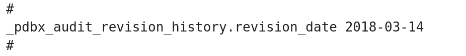
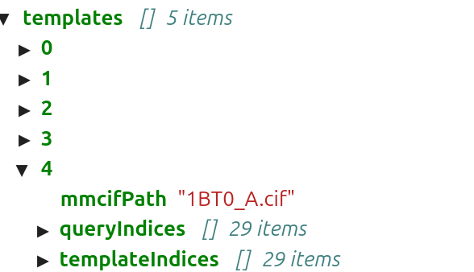
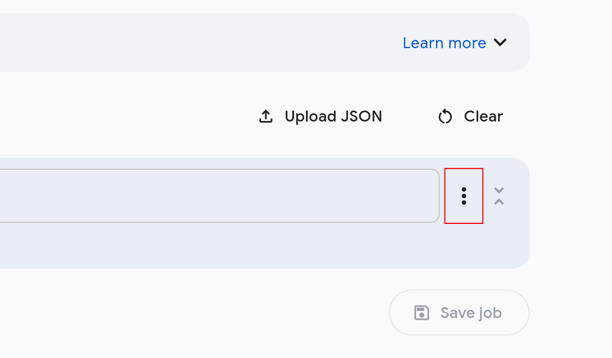
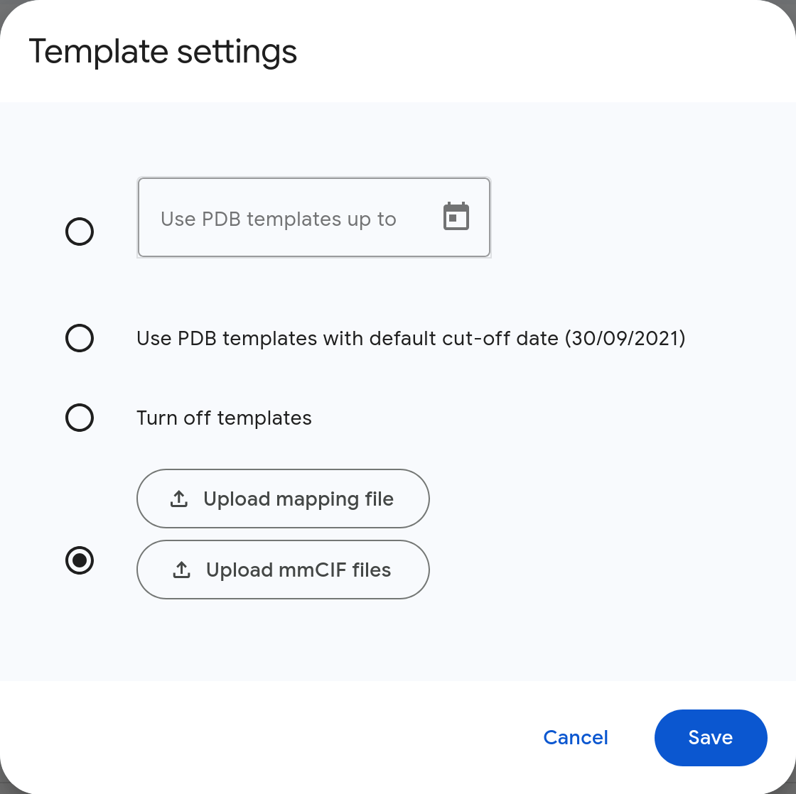

# Using Templates in Structure Prediction

Both AlphaFold3 and Boltz2 have the option to use an existing 3D structure as a template to guide the prediction. 

## Boltz2 

In the Boltz input, only a template `.cif` or `.pdb` file and a some information of the chain is needed. The program finds the residues cirectly. For more information see the [Boltz2 documentation on templates](https://github.com/jwohlwend/boltz/blob/main/docs/prediction.md#templates)

## AlphaFold3

For AlphaFold3, a `.cif` file is needed. `.pdb` files have to be converted to `.cif` using e.g. pymol or chimera. Note that AlphaFold3 expects specific fields in the `.cif` file to be present. You can modify the file using a text editor. Especially the `_pdbx_audit_revision_history.revision_date` needs to be present. For more details see [here](https://github.com/google-deepmind/alphafold3/issues/416).

{:.invertable style="width:473px"}

Additionally, a list of incides in the query and template sequence is required, that defines maping from query residues to template residues. For more information see the [AlphaFold3 documentation on templates](https://github.com/google-deepmind/alphafold3/blob/main/docs/input.md#structural-templates).

If you want to use the template locally, only these lists are required. To use templates on the [AlphaFold3 server](https://alphafoldserver.com), a mapping file is required. Both the list of indices and the mapping field can be created using our jupyter notebook : [AFold3_mapping.ipynb](../../notebooks/AFold3_mapping.ipynb).This notebook does not need to be executed on bwVisu, but can run locally on your computer. Or conveniently in Google Colab.
<!--- add this link once tutorial goes live -->

### Using Templates on bwVisu or other local installations

Once you created the list of incides in the query and template sequence, you can start with the MSA calculation as usual. You can also recycle a previously calculated MSA. Then you need to modify the input `*_data.json` file in the `output/` directory to add the information on the reference `.cif` file and residue lists:

{:.invertable style="width:269px"}

Note that the `.cif` file needs to be uploaded into the same directory as the  `*_data.json` file.

### Using Templates on the Alphafold3 Server

On the [AlphaFold3 server](https://alphafoldserver.com), you can upload the template `.cif` and the mapping file by clicking on the three dots next to your sequence and choose `template settings`:

{:.invertable  style="width:269px"}

This opens the template menu, where you can upload the `.cif` and the mapping file: 

{:.invertable  style="width:285px"}